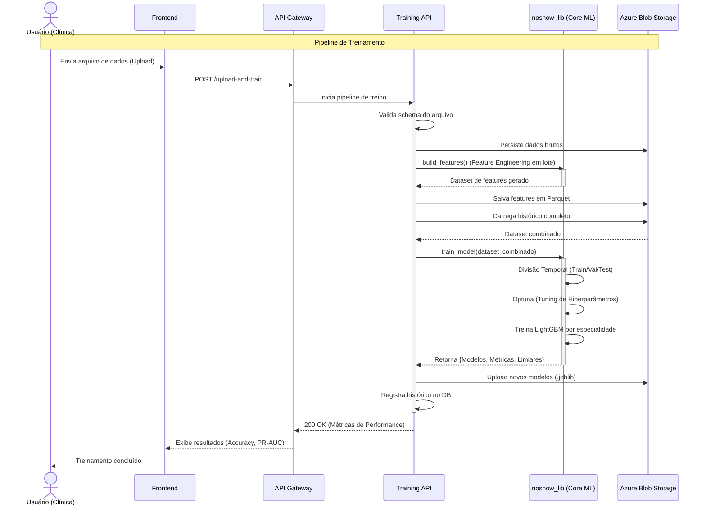

# No-Show Training API

## Visão geral

API FastAPI responsável por orquestrar o pipeline completo de treinamento de modelos de predição de não comparecimento em consultas médicas. O diferencial desta API está na estratégia de modelos agrupados por especialidade médica: ao invés de um único modelo global, o `noshow_lib` treina um modelo LightGBM dedicado para cada grupo de especialidade com volume suficiente de dados, mais um modelo fallback para especialidades menos frequentes. Isso permite que cada modelo capture padrões específicos de absenteísmo por área médica.

O treinamento é executado de forma assíncrona em background, combinando dados históricos persistidos no Blob Storage com novos dados enviados via upload, ou somente com dados existentes no caso do retraining. O histórico de jobs e métricas é persistido em banco de dados para rastreabilidade.

## Funcionalidades principais

- Validação de arquivos CSV, Excel e Parquet (`POST /validate`)
- Upload e agendamento de treino assíncrono (`POST /upload-and-train`)
- Retraining com dados existentes no Blob (`POST /retrain`)
- Consulta de status do job por ID (`GET /status/{job_id}`)
- Registro de histórico de modelos no banco de dados
- Health check (`GET /`)

## Como funciona

1. O arquivo é enviado e salvo temporariamente
2. O schema é validado contra a configuração do Blob Storage
3. Um job de treinamento é criado no banco com status `pending` e o `job_id` é retornado imediatamente
4. O treinamento roda em background: pré-processamento → feature engineering → treino por especialidade → serialização
5. Os modelos treinados são enviados ao Azure Blob Storage como arquivos `.joblib`
6. As métricas e metadados são registrados no banco de dados
7. O cliente consulta `GET /status/{job_id}` para acompanhar o progresso

## Endpoints principais

- `POST /validate` — valida o arquivo sem iniciar treinamento
- `POST /upload-and-train` — inicia treino com novo arquivo, retorna `job_id` (HTTP 202)
- `POST /retrain` — reagenda treinamento usando dados existentes no Blob e feedback de predições
- `GET /status/{job_id}` — retorna status (`pending` / `running` / `success` / `failed`) e métricas ao final
- `GET /` — verifica se a API está saudável

## Métricas retornadas

Ao concluir, o job expõe métricas por especialidade:

- `roc_auc`, `pr_auc`
- `f1_score`, `recall`, `precision`, `accuracy`
- `threshold` — limiar calibrado pelo Optuna
- `training_time_seconds`, `dataset_rows`

A configuração do modelo (hiperparâmetros, features selecionadas, colunas obrigatórias) é totalmente gerenciada pelo `noshow_lib` via `config.yaml` interno.

## Requisitos de dados

O arquivo enviado deve conter colunas compatíveis com o schema de treinamento. Campos de referência:

- `PatientId`, `AppointmentID`
- `Gender`, `Age`, `Neighbourhood`
- `ScheduledDay`, `AppointmentDay`
- `Scholarship`, `Hipertension`, `Diabetes`, `Alcoholism`, `Handcap`
- `SMS_received`, `No-show`

A validação final usa o schema de colunas definido na configuração do Blob Storage.

## Banco de dados

As tabelas são criadas automaticamente na startup via `Base.metadata.create_all()` caso não existam no banco configurado (Azure SQL / SQL Server via pyodbc).

| Tabela          | Descrição                                                                         |
| --------------- | --------------------------------------------------------------------------------- |
| `TrainingJob`   | Rastreia cada job de treinamento com status, timestamps e resultado JSON          |
| `ModelRegistry` | Histórico de modelos publicados com métricas, versão, especialidade e URL do Blob |

## Estrutura do projeto

- `app/main.py` — inicialização do FastAPI, roteadores e criação de tabelas
- `app/routes/training_routes.py` — endpoints de validação, upload, status e retraining
- `app/services/data_validation.py` — validação de formato e schema do arquivo
- `app/services/data_preprocessing.py` — pré-processamento e feature engineering via noshow_lib
- `app/services/training_service.py` — pipeline de treino e serialização dos modelos
- `app/services/model_history.py` — persistência do histórico de modelos no banco
- `app/services/blob_service.py` — upload/download no Azure Blob Storage
- `app/models/schemas.py` — modelos Pydantic para requests e responses
- `app/models/sql_models.py` — modelos SQLAlchemy (`TrainingJob`, `ModelRegistry`)
- `app/database.py` — engine e sessão SQLAlchemy
- `app/config.py` — variáveis de ambiente e configuração
- `app/utils/` — logger e helpers genéricos

## Tecnologias principais

| Tecnologia                    | Por quê                                                                                                                                                            |
| ----------------------------- | ------------------------------------------------------------------------------------------------------------------------------------------------------------------ |
| **FastAPI + BackgroundTasks** | Permite retornar o `job_id` imediatamente e executar o treino de forma assíncrona sem bloquear a API                                                               |
| **noshow_lib**                | Encapsula todo o pipeline de ML — pré-processamento, feature engineering, treino por especialidade com Optuna e serialização — em uma única dependência versionada |
| **LightGBM** (via noshow_lib) | Excelente desempenho em dados tabulares com alta cardinalidade e desbalanceamento de classes, comum em datasets de saúde                                           |
| **Optuna** (via noshow_lib)   | Otimização automática de hiperparâmetros e threshold de classificação                                                                                              |
| **SQLAlchemy + pyodbc**       | ORM com criação automática de tabelas e suporte a Azure SQL                                                                                                        |
| **Azure Blob Storage**        | Armazenamento centralizado dos modelos publicados, acessível tanto pela Training API quanto pela Prediction API                                                    |
| **pandas + pyarrow**          | Manipulação eficiente de grandes volumes de dados durante o pipeline de treino                                                                                     |

## Uso local

```bash
git clone <repo>
cd no-show-training-api
pip install -r requirements.txt
uvicorn app.main:app --reload --host 0.0.0.0 --port 8000
```

## Testes

```bash
pytest
```

## CI/CD

Pipeline executado via GitHub Actions em pushes para `develop`, `homolog` e `prod`:

1. **Build** — instala dependências com Python 3.11
2. **Lint** — análise estática com Flake8
3. **Tests** — execução de testes com pytest
4. **Security** — varredura de segurança com Bandit
5. **Deploy** — publicação automática no Azure Container Apps (apenas `homolog` e `prod`)

## Docker

```bash
docker build -t no-show-training-api .
docker run -p 8000:8000 --env-file .env no-show-training-api
```

## Diagrama de sequência



## Integração

Este serviço é consumido pelo frontend `showUp` para iniciar novos treinamentos e consultar o histórico de modelos. Configure a URL via variável de ambiente `VITE_TRAINING_API_URL` no frontend.

## Licença

MIT
